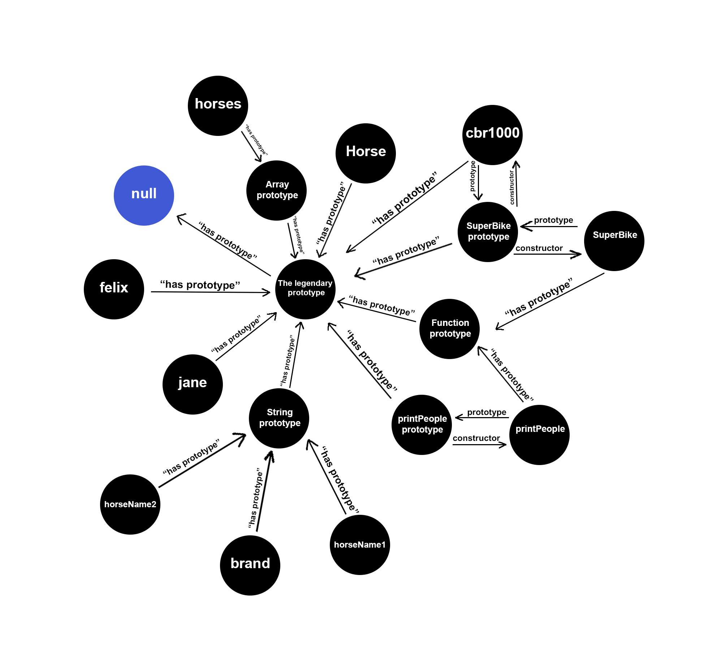

Sa se deseneze graful de prototipuri pentru codul de mai jos:

const felix = { name: "Felix" };  
const jane = { name: "Jane" };  

function printPeople(p1, p1) {
    console.log(p1, p2);
}  

printPeople(felix, jane);  

function SuperBike(brand) {
    this.brand = brand;
}  

const brand = "Honda CBR1000RR Fire blade"    
const cbr1000 = new SuperBike(brand);  

class Horse {
    constructor(name) {
        this.name = name;
    }
}  

const horseName1 = "Tornado"; 
const horseName2 = "Spirit"; 

const horses = [new Horse(horseName1), new Horse(horseName2)];

